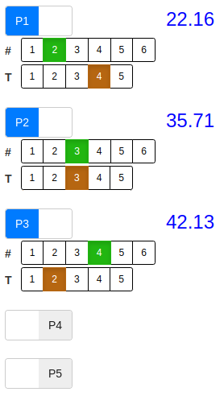

# Battle odds calculator for Andromeda's Edge

## Live app 1

[https://bgcalc.shinyapps.io/boc4ae](https://bgcalc.shinyapps.io/boc4ae)

There's a 25 active hours per month limit on this site.

## Live app 2

[https://bgcalc.github.io/boc4ae](https://bgcalc.github.io/boc4ae)

This is unlimited but please be aware that the _first_ launch of this app will take some time...

## Usage

Input: P1, ..., P5: participants; #: number of dice; T: targeting value.

Output: chance of winning (%).

**Enjoy!**

Written in R Shiny, deployed via shinyapps.io / Shinylive + github.io.

Note: Andromeda's Edge © is a [board game](https://cardboardalchemy.com/andromedas-edge/) by Cardboard Alchemy.
